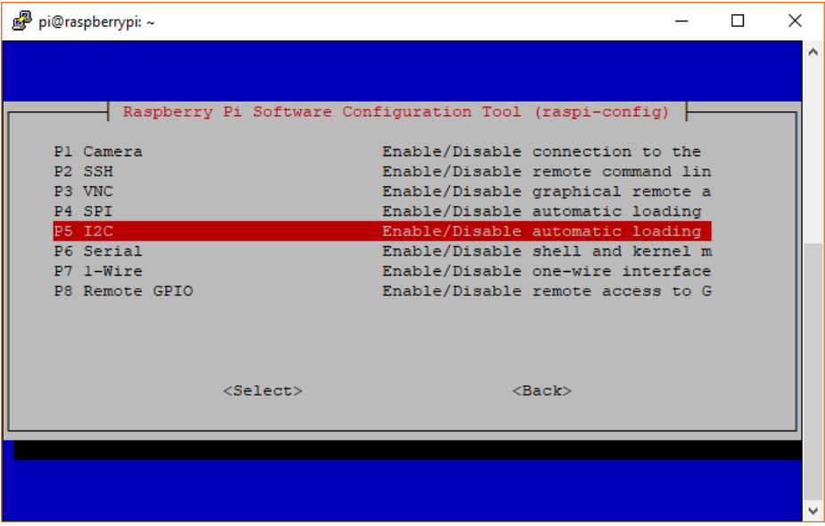

This tutorial will teach your how to set up your Raspbian image to run rover-app applications from scratch and the basic workflow.

# Writing a Raspbian image on a SD card 
First, you will need a fresh Raspbian image. You can download from [here](https://www.raspberrypi.org/downloads/raspbian/).
The image you will use is **Raspbian Stretch with desktop and recommended software**.
Then you will write an image to your SD card following next described on the official Raspbian [site](https://www.raspberrypi.org/documentation/installation/installing-images/).

**IMPORTANT**: Before inserting your SD card into your laptop/PC check that it is **NOT** locked

Once you wrote successfully your Raspbian image on your SD card, insert it into the  Raspberry Pi.


# Configuring I2C, SSH and SPI 
After your fresh installation you will need to configure the Raspberry Pi in order to run rover-app applications. 
**IMPORTANT**: Do **NOT** update your Raspbian image, this will take a lot of time.

## Enable I2C
0. Open a terminal window
1. Run `sudo raspi-config` 
2. Use the down arrow to select `5 Interfacing Options`
3. Arrow down to `P2 ssh`.
4. Select yes when it asks you to enable SSH
5. Use the right arrow to select the `<Finish>` button.
6. Select yes when it asks to reboot.




if everything went well, when you run `ls /dev/*i2c*`, the Pi should respond with `/dev/i2c-1`

## Enable SSH
0. Open a terminal window
1. Run `raspi-config` 
2. Use the down arrow to select `5 Interfacing Options`
3. Arrow down to `P2 ssh`.
4. Select yes when it asks you to enable SSH
5. Use the right arrow to select the `<Finish>` button.
6. Select yes when it asks to reboot.

if everything went well, you should be able to connect through ssh from other computer.  

## Enable SPI
0. Open a terminal window
1. Run `raspi-config` 
2. Use the down arrow to select `5 Interfacing Options`
3. Arrow down to `P4 spi`.
4. Select yes when it asks you to enable SPI
5. Use the right arrow to select the `<Finish>` button.
6. Select yes when it asks to reboot.

Reboot your RPI3

# Installing Rover-app dependencies

## Install CMake
```sh
$ sudo apt-get install cmake
```

## Install  wiring pi

```sh
$ cd ~/  && \
    git clone git://git.drogon.net/wiringPi && \
    cd wiringPi/ &&  \
    git pull origin && \
    ./build
```

## Install jsoncpp

```sh
$ sudo apt-get -y install libjsoncpp-dev && \
    sudo ln -s /usr/include/jsoncpp/json/ /usr/include/json
```

## Install Openssl
```sh
sudo apt-get -y install libssl-dev
```

## Install paho.mqtt.c

```sh
cd ~/ && \
    git clone https://github.com/eclipse/paho.mqtt.c.git && \
    cd paho.mqtt.c/ && \
    make && \
    sudo make install
```

## Install i2c tools

```sh
$ sudo  apt-get install -y libi2c-dev i2c-tools lm-sensors
```

## Install psutil

```sh
$ pip install psutil
``` 

## Install bluetooth

```sh
sudo apt-get install -y bluez \
    libbluetooth-dev
```

## Install OpenCV full

This installation follows the steps described [here](https://www.pyimagesearch.com/2015/10/26/how-to-install-opencv-3-on-raspbian-jessie/)


- Dependencies

```sh
$ sudo apt-get install -y libjpeg-dev libtiff5-dev libjasper-dev libpng12-dev
$ sudo apt-get install -y libavcodec-dev libavformat-dev libswscale-dev libv4l-dev
$ sudo apt-get install -y libxvidcore-dev libx264-dev
$ sudo apt-get install -y libgtk2.0-dev
$ sudo apt-get install libatlas-base-dev gfortran
```

- Getting OpenCV
```sh
$ cd ~
$ wget -O opencv.zip https://github.com/Itseez/opencv/archive/3.4.1.zip
$ unzip opencv.zip
```

- Getting opencv contrib 
```sh
$ wget -O opencv_contrib.zip https://github.com/Itseez/opencv_contrib/archive/3.4.1.zip
$ unzip opencv_contrib.zip
```

- Compiling OpenCV
```sh
$ cd ~/opencv-3.4.1/
$ mkdir build
$ cd build
$ cmake -D CMAKE_BUILD_TYPE=RELEASE \
	-D CMAKE_INSTALL_PREFIX=/usr/local \
	-D INSTALL_C_EXAMPLES=ON \
	-D INSTALL_PYTHON_EXAMPLES=ON \
	-D OPENCV_EXTRA_MODULES_PATH=~/opencv_contrib-3.4.1/modules \
	-D BUILD_EXAMPLES=ON ..
```

- Check if you have any errors, if you check all the previous steps. Otherwise

```sh
$ make -j4
```

This step will take some hours from 2 up to 5-6, depending on the size of your SD card and the speed.
Once you are done, let's install OpenCV

```sh
$ sudo make install
$ sudo ldconfig 
```
## Install raspicam

```sh
$ cd ~/ && \
     git clone https://github.com/6by9/raspicam-0.1.3.git && \
     cd raspicam-0.1.3 && \
     mkdir -p build && \
     cd build && \
     cmake .. &&\
     make &&\
     sudo make install
```


#  Rover-app

## Compiling

```sh
$ cd ~
$ git clone https://github.com/app4mc-rover/rover-app.git
$ cd rovep-app/
$ ./make_roverapp.sh
```

## Connection to Hono

You will need a configuration in order to connect to Hono Server. 
There is a file called `rover.conf.sample` in the directory `samples`

```sh
$ cd samples/
```

Modify that file with the following values

```
# Configuration file for roverapp.
# Place in /etc/rover.conf
ROVER_IDENTITY_C=1
MQTT_BROKER_C=65.52.138.68
MQTT_BROKER_PORT_C=1883
ROVER_MQTT_QOS_C=1
MQTT_USERNAME_C=rover3@rover
MQTT_PASSWORD_C=rover-secret
USE_GROOVE_SENSOR_C=0
USE_REDIRECTED_TOPICS_C=1
HONO_HTTP_HOST_C=65.52.155.115
HONO_HTTP_PORT_C=8080
HONO_HTTP_TENANT_NAME_C=DEFAULT_TENANT
HONO_HTTP_DEVICE_ID_C=4711
HONO_HTTP_REGISTER_PORT_C=28080
HONO_HTTP_USERNAME_C=sensor1
HONO_HTTP_PASSWORD_C=hono-secret
```

**Important**: each rover will need a different `MQTT_USERNAME_C`. In general is `roverN@rover`,where N can be 1-5.

Copy the file to the right location
```sh
$ sudo cp samples/rover.conf.sample /etc/rover.conf
```

## Running rover-app

```sh
$ cd build/bin
$ sudo ./roverapp
``` 

To stop the execution just press `ctrl+c` until the application has stopped.
